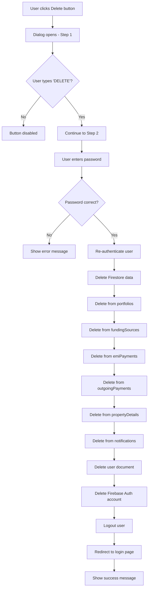

# 🗑️ Delete Account Feature - Implementation Summary

## ✅ What's Been Implemented

A fully functional account deletion feature has been added to the Settings page with comprehensive security measures.

---

## 🎯 Features

### **Two-Step Deletion Process**

1. **Confirmation Step**: User must type "DELETE" to confirm
2. **Re-authentication Step**: User must enter password for security

### **Complete Data Deletion**

The feature deletes ALL user data from the following Firestore collections:

- ✅ `portfolios` - Portfolio records
- ✅ `fundingSources` - Funding source documents
- ✅ `emiPayments` - EMI payment records
- ✅ `outgoingPayments` - Outgoing payment records
- ✅ `propertyDetails` - Property configuration documents
- ✅ `notifications` - Notification settings
- ✅ `users/{userId}` - User profile document
- ✅ **Firebase Authentication account** - Complete account removal

---

## 📁 Files Created/Modified

### **New Files:**

1. **`frontend/components/settings/DeleteAccountDialog.tsx`**
   - Two-step deletion dialog component
   - Re-authentication with Firebase
   - Comprehensive data deletion logic
   - Error handling and user feedback

### **Modified Files:**

1. **`frontend/app/dashboard/settings/page.tsx`**
   - Added delete dialog state management
   - Integrated DeleteAccountDialog component
   - Connected Delete button to open dialog

---

## 🔒 Security Features

### **1. Re-authentication Required**

- Uses `reauthenticateWithCredential()` from Firebase
- Prevents unauthorized deletion
- Validates current session

### **2. Confirmation Dialog**

- User must type "DELETE" exactly
- Prevents accidental deletion
- Clear warning messages

### **3. Password Verification**

- User must enter current password
- Uses Firebase's secure credential system
- Handles wrong password errors

### **4. Comprehensive Error Handling**

- Wrong password detection
- Too many attempts protection
- Requires recent login checks
- Generic error fallback

---

## 🔄 Deletion Flow



---

## 🎨 UI/UX Details

### **Step 1: Confirmation**

- Red-themed warning dialog
- List of data to be deleted
- Input field for typing "DELETE"
- Disabled Continue button until confirmed

### **Step 2: Re-authentication**

- Yellow-themed security notice
- Password input field
- Disabled Delete button until password entered
- Loading state during deletion

### **Visual Feedback**

- Toast notifications for all actions
- Loading spinner during deletion
- Clear error messages
- Automatic redirect after success

---

## 🧪 Testing Checklist

### **Basic Functionality:**

- [ ] Click Delete button opens dialog
- [ ] Cancel button closes dialog
- [ ] Continue disabled until "DELETE" typed
- [ ] Step 2 shows after typing "DELETE"
- [ ] Delete disabled until password entered

### **Security Testing:**

- [ ] Wrong password shows error
- [ ] Correct password proceeds with deletion
- [ ] User is logged out after deletion
- [ ] Cannot access account after deletion
- [ ] Re-authentication required for safety

### **Data Deletion:**

- [ ] All portfolios deleted
- [ ] All funding sources deleted
- [ ] All EMI payments deleted
- [ ] All outgoing payments deleted
- [ ] All property details deleted
- [ ] All notifications deleted
- [ ] User document deleted
- [ ] Firebase Auth account deleted

### **Error Handling:**

- [ ] Network errors handled gracefully
- [ ] Firestore permission errors caught
- [ ] Auth errors shown to user
- [ ] Generic errors have fallback message

---

## 🚨 Error Messages

The feature handles these Firebase Auth errors:

| Error Code                   | User Message                                               |
| ---------------------------- | ---------------------------------------------------------- |
| `auth/wrong-password`        | "Incorrect password. Please try again."                    |
| `auth/too-many-requests`     | "Too many attempts. Please try again later."               |
| `auth/requires-recent-login` | "Please log out and log in again before deleting account." |
| Generic error                | "Failed to delete account. Please try again."              |

---

## 💡 Implementation Notes

### **Data Deletion Strategy:**

1. Query each collection with `where("userId", "==", userId)`
2. Get all matching documents
3. Create delete promises for each document
4. Execute all deletions in parallel with `Promise.all()`
5. Delete user document last
6. Finally delete Firebase Auth account

### **Why This Order:**

- Firestore data deleted first (recoverable if Auth deletion fails)
- Auth account deleted last (irreversible)
- Ensures maximum data cleanup even if Auth deletion fails

### **Collection Names:**

These collection names are used in queries:

```typescript
const collections = [
  "portfolios",
  "fundingSources",
  "emiPayments",
  "outgoingPayments",
  "propertyDetails",
  "notifications",
];
```

**Note:** If you add new collections in the future, add them to this array!

---

## 📝 Code Examples

### **Opening the Dialog:**

```typescript
// In Settings page
const [deleteDialogOpen, setDeleteDialogOpen] = useState(false);

<Button onClick={() => setDeleteDialogOpen(true)}>Delete</Button>;
```

### **Using the Dialog:**

```typescript
<DeleteAccountDialog
  open={deleteDialogOpen}
  onOpenChange={setDeleteDialogOpen}
/>
```

---

## 🔐 Firestore Security Rules

Ensure your Firestore security rules allow users to delete their own data:

```javascript
rules_version = '2';
service cloud.firestore {
  match /databases/{database}/documents {
    // Allow users to delete their own documents
    match /{collection}/{docId} {
      allow delete: if request.auth != null
                    && resource.data.userId == request.auth.uid;
    }

    // User document
    match /users/{userId} {
      allow delete: if request.auth != null
                    && request.auth.uid == userId;
    }
  }
}
```

---

## 🎉 Success Criteria

- ✅ User can delete their account from Settings page
- ✅ Two-step confirmation process prevents accidents
- ✅ Re-authentication ensures security
- ✅ All user data completely removed from Firestore
- ✅ Firebase Auth account deleted
- ✅ User logged out and redirected
- ✅ Clear error messages for all failure cases
- ✅ Loading states during deletion
- ✅ Cannot access deleted account

---

## 🚀 Future Enhancements

Consider adding:

- [ ] Email confirmation before deletion
- [ ] Grace period (30 days) before permanent deletion
- [ ] Export data option before deletion
- [ ] Deletion audit log for compliance
- [ ] Admin override for account recovery

---

## 📞 Support

If users encounter issues:

1. Check browser console for errors
2. Verify Firebase permissions
3. Ensure user is logged in recently
4. Check Firestore security rules
5. Verify all collections exist

**Common Issue:** "Requires recent login"

- **Solution:** User must log out and log back in before deleting account

---

**✅ Account deletion is now fully functional and secure!**
