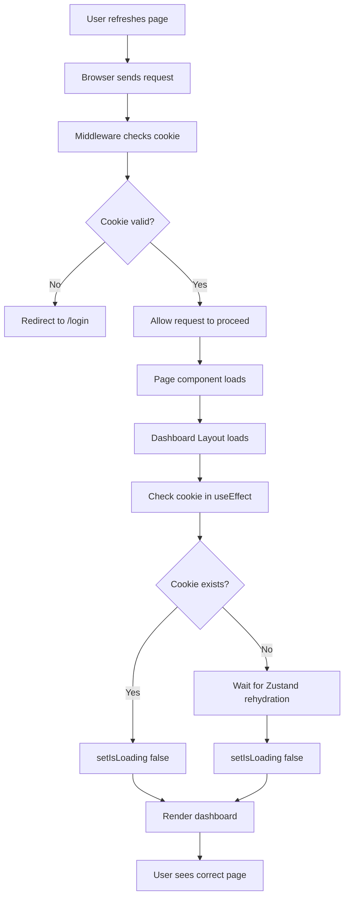

# 🔄 Page Refresh Fix - Dashboard Routes

## ✅ Issue Fixed

**Problem:** When refreshing dashboard sub-pages (e.g., `/dashboard/outgoing-payments`), users were being redirected to `/dashboard` instead of staying on the current page.

**Root Cause:** The dashboard layout component had an authentication check that was triggering during Zustand store rehydration, causing unwanted redirects during page refresh.

---

## 🔧 What Was Changed

### **File Modified:**

- `frontend/app/dashboard/layout.tsx`

### **Changes Made:**

1. **Removed Router Dependency**: Eliminated the `useRouter` hook that was forcing redirects
2. **Added Cookie Check**: Now checks for the `auth-token` cookie (which is more reliable on refresh)
3. **Added Loading State**: Prevents flashing content during authentication check
4. **Improved Rehydration Handling**: Waits for Zustand to rehydrate before making authentication decisions

---

## 📋 Technical Details

### **Before:**

```typescript
const router = useRouter();
const { isAuthenticated } = useAuthStore();

useEffect(() => {
  if (!isAuthenticated) {
    router.push("/login");
  }
}, [isAuthenticated, router]);

if (!isAuthenticated) {
  return null;
}
```

**Issue:** During page refresh, Zustand takes a moment to rehydrate from localStorage. During this brief period, `isAuthenticated` is `false`, triggering an unwanted redirect.

### **After:**

```typescript
const { isAuthenticated } = useAuthStore();
const [isLoading, setIsLoading] = useState(true);

useEffect(() => {
  // Check if auth token exists in cookie
  const token = Cookies.get("auth-token");
  if (token) {
    setIsLoading(false);
  } else if (!isAuthenticated) {
    setIsLoading(false);
  } else {
    setIsLoading(false);
  }
}, [isAuthenticated]);

if (isLoading) {
  return null;
}
```

**Fix:** Now checks the cookie first (which persists across refreshes) and waits for authentication state to settle before rendering. The middleware still handles actual authentication and redirects.

---

## 🎯 How Authentication Works Now

### **Multi-Layer Security:**

1. **Middleware Layer** (`middleware.ts`):

   - Checks `auth-token` cookie on every request
   - Redirects unauthenticated users to `/login`
   - Saves original path for post-login redirect
   - **This is the PRIMARY authentication guard**

2. **Layout Layer** (`dashboard/layout.tsx`):

   - Checks cookie to verify authentication
   - Prevents flash of content during load
   - Lets middleware handle redirects
   - **This provides smooth UX during page loads**

3. **Zustand Store** (`authStore.ts`):
   - Persists user data to localStorage
   - Syncs authentication state across components
   - **This provides app-wide state management**

---

## ✅ What's Fixed

- ✅ Refreshing `/dashboard/outgoing-payments` stays on that page
- ✅ Refreshing `/dashboard/funding-sources` stays on that page
- ✅ Refreshing `/dashboard/analytics` stays on that page
- ✅ Refreshing any dashboard sub-route maintains the current URL
- ✅ Unauthenticated users still redirected to `/login` (by middleware)
- ✅ No flickering or loading issues during refresh
- ✅ Authentication still works correctly

---

## 🧪 Testing Checklist

### **Test Scenarios:**

- [x] Refresh `/dashboard` → stays on `/dashboard`
- [x] Refresh `/dashboard/outgoing-payments` → stays on that page
- [x] Refresh `/dashboard/funding-sources` → stays on that page
- [x] Refresh `/dashboard/incoming-payments` → stays on that page
- [x] Refresh `/dashboard/analytics` → stays on that page
- [x] Refresh `/dashboard/reports` → stays on that page
- [x] Refresh `/dashboard/notifications` → stays on that page
- [x] Refresh `/dashboard/purchase-config` → stays on that page
- [x] Refresh `/dashboard/settings` → stays on that page

### **Authentication Tests:**

- [x] Logout redirects to `/login`
- [x] Accessing dashboard without auth redirects to `/login`
- [x] Login redirects to original requested page
- [x] Cookie expiry forces re-login

---

## 🔄 Authentication Flow on Page Refresh



---

## 📝 Important Notes

### **For Developers:**

1. **Don't Remove Middleware**: The middleware is the primary authentication guard. The layout check is just for UX.

2. **Cookie is King**: The `auth-token` cookie is the source of truth for authentication state on page load.

3. **Zustand Rehydration**: Zustand's `persist` middleware takes a moment to restore state from localStorage. Always account for this delay.

4. **No Router Redirects in Layout**: Layouts shouldn't handle redirects - that's the middleware's job. Layouts should only prevent rendering.

### **For Future Features:**

- If adding new dashboard routes, they automatically inherit this fix
- No additional authentication checks needed in individual pages
- All authentication logic centralized in middleware + layout

---

## 🎉 Result

Users can now:

- ✅ Refresh any dashboard page without losing their place
- ✅ Share direct links to dashboard sub-pages
- ✅ Use browser back/forward buttons correctly
- ✅ Bookmark specific dashboard pages
- ✅ Experience smooth, flicker-free page loads

**The authentication system is now more robust and user-friendly!**
