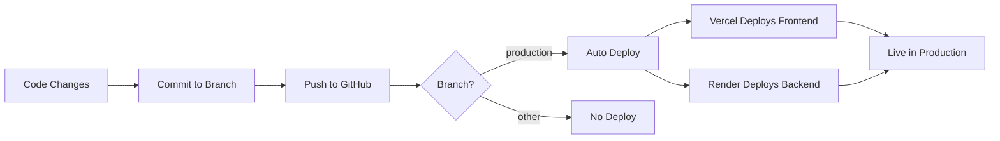

# 🌐 Production Deployment - Property Purchase Management System

This document provides all the information needed to deploy and maintain the Property Purchase Management System in production.

## 📚 Documentation Index

1. **[QUICK-DEPLOY.md](./QUICK-DEPLOY.md)** - 30-minute quick deployment guide
2. **[DEPLOYMENT-GUIDE.md](./DEPLOYMENT-GUIDE.md)** - Comprehensive deployment documentation
3. **[DEPLOYMENT-CHECKLIST.md](./DEPLOYMENT-CHECKLIST.md)** - Step-by-step checklist
4. This file - Production overview and quick reference

---

## 🎯 Quick Start (30 Minutes)

Follow these steps to deploy your application:

### 1. Prerequisites (5 minutes)

```bash
✓ GitHub account with production branch
✓ Firebase project created
✓ Gmail with App Password
✓ Vercel account
✓ Render account
```

### 2. Deploy Backend (10 minutes)

1. Go to [Render](https://render.com) → New Web Service
2. Connect GitHub → Select `production` branch
3. Configure: `backend/`, Python 3.11, Port 10000
4. Add environment variables (see below)
5. Deploy and copy backend URL

### 3. Deploy Frontend (5 minutes)

1. Go to [Vercel](https://vercel.com) → New Project
2. Import repository → Select `production` branch
3. Configure: `frontend/`, Next.js
4. Add environment variables (see below)
5. Deploy and copy frontend URL

### 4. Update CORS (2 minutes)

1. Go back to Render
2. Update `CORS_ORIGINS` with Vercel URL
3. Redeploy backend

### 5. Test Everything (8 minutes)

1. Visit frontend URL
2. Register new account
3. Test all features
4. Verify email notifications

**🎉 Done! Your app is live!**

---

## 🔐 Environment Variables Reference

### Backend (.env)

```bash
# Required - Application
ENVIRONMENT=production
PORT=10000

# Required - JWT Security
JWT_SECRET_KEY=your-random-32-character-secret
JWT_ALGORITHM=HS256
JWT_ACCESS_TOKEN_EXPIRE_MINUTES=30

# Required - Firebase
FIREBASE_ADMIN_SDK_JSON={"type":"service_account"...}

# Required - Email (Gmail)
SMTP_SERVER=smtp.gmail.com
SMTP_PORT=587
SMTP_USERNAME=your-email@gmail.com
SMTP_PASSWORD=your-16-char-app-password
FROM_EMAIL=your-email@gmail.com
FROM_NAME=Property Purchase Management

# Required - CORS
CORS_ORIGINS=https://your-app.vercel.app

# Required - Database
DATABASE_TYPE=firestore
```

### Frontend (.env.local)

```bash
# Required - Firebase
NEXT_PUBLIC_FIREBASE_API_KEY=AIza...
NEXT_PUBLIC_FIREBASE_AUTH_DOMAIN=project.firebaseapp.com
NEXT_PUBLIC_FIREBASE_PROJECT_ID=project-id
NEXT_PUBLIC_FIREBASE_STORAGE_BUCKET=project.appspot.com
NEXT_PUBLIC_FIREBASE_MESSAGING_SENDER_ID=123...
NEXT_PUBLIC_FIREBASE_APP_ID=1:123...

# Required - Backend API
NEXT_PUBLIC_API_URL=https://backend.onrender.com
```

---

## 🚀 Deployment Commands

### Automated Deployment Script (Windows)

```powershell
# Navigate to project root
cd "d:\Personal Projects\Housing Management"

# Run deployment script
.\scripts\deploy-production.ps1
```

### Manual Deployment

```bash
# 1. Switch to production branch
git checkout production

# 2. Pull latest changes
git pull origin production

# 3. Make your changes (if any)
# ... edit files ...

# 4. Commit changes
git add .
git commit -m "Your deployment message"

# 5. Push to trigger auto-deployment
git push origin production

# ✅ Vercel and Render will auto-deploy!
```

---

## 📊 Platform Configuration

### Vercel (Frontend)

**Build Settings:**

```
Framework: Next.js
Root Directory: frontend
Build Command: npm run build (auto-detected)
Output Directory: .next (auto-detected)
Install Command: npm install (auto-detected)
Node Version: 18.x
```

**Features:**

- ✅ Automatic HTTPS
- ✅ CDN distribution
- ✅ Serverless functions
- ✅ Analytics built-in
- ✅ Git-based deployments

### Render (Backend)

**Service Settings:**

```
Name: property-management-backend
Runtime: Python 3.11
Region: Oregon (or closest to you)
Branch: production
Root Directory: backend
Build Command: pip install -r requirements.txt
Start Command: uvicorn main:app --host 0.0.0.0 --port $PORT
```

**Features:**

- ✅ Automatic HTTPS
- ✅ Health checks
- ✅ Auto-deploy on push
- ✅ Environment variables
- ✅ Logging and metrics

---

## 🗄️ Database Configuration

### Firestore Setup

1. **Create Database**

   - Go to Firebase Console
   - Enable Firestore (Production Mode)
   - Choose location

2. **Security Rules**

   ```javascript
   rules_version = '2';
   service cloud.firestore {
     match /databases/{database}/documents {
       match /{document=**} {
         allow read, write: if request.auth != null;
       }
     }
   }
   ```

3. **Collections** (Auto-created)
   - `users` - User profiles
   - `properties` - Property configurations
   - `funding_sources` - Funding sources
   - `payments` - EMI payments
   - `outgoing_payments` - Outgoing payments
   - `notifications` - Notification settings

---

## 📧 Email Configuration

### Gmail App Password Setup

1. Go to [Google Account Security](https://myaccount.google.com/security)
2. Enable **2-Step Verification**
3. Go to **App Passwords**
4. Create new: Mail → Other (Property Management)
5. Copy 16-character password
6. Use in `SMTP_PASSWORD` environment variable

**Important:**

- ✅ Use App Password (16 chars, no spaces)
- ❌ Don't use regular Gmail password
- ✅ 2-Step Verification must be enabled
- 📊 Gmail limit: 500 emails/day

---

## 🔍 Monitoring & Maintenance

### Health Checks

**Backend Health:**

```bash
https://your-backend.onrender.com/health
```

**Frontend:**

```bash
https://your-app.vercel.app
```

**API Documentation:**

```bash
https://your-backend.onrender.com/docs
```

### Logs

**Vercel Logs:**

1. Dashboard → Your Project → Deployments
2. Click on deployment → View Function Logs

**Render Logs:**

1. Dashboard → Your Service → Logs
2. Real-time streaming logs

**Firebase Logs:**

1. Console → Firestore → Usage
2. Monitor reads/writes

### Metrics

**Vercel Analytics:**

- Visitor tracking
- Page views
- Performance metrics

**Render Metrics:**

- CPU usage
- Memory usage
- Request rates

---

## 🐛 Troubleshooting

### Common Issues

**1. CORS Error**

```
Error: Access to fetch at 'https://backend...' has been blocked by CORS
```

**Fix:** Update `CORS_ORIGINS` in backend to match frontend URL exactly

**2. Firebase Auth Error**

```
Error: Firebase: Error (auth/configuration-not-found)
```

**Fix:** Check all `NEXT_PUBLIC_FIREBASE_*` environment variables

**3. Email Not Sending**

```
Error: (535, b'5.7.8 Username and Password not accepted')
```

**Fix:** Use Gmail App Password (16 chars), enable 2-Step Verification

**4. Build Failed**

```
Error: Build failed with exit code 1
```

**Fix:** Check build logs, verify all dependencies in package.json

---

## 🔄 CI/CD Pipeline

### Automatic Deployment Workflow



### GitHub Actions (Optional)

If you set up the GitHub Actions workflow:

1. Every push to `production` triggers build
2. Tests run automatically
3. Deployment happens after tests pass
4. Notifications sent on success/failure

---

## 📈 Scaling Considerations

### Current Setup (Free Tier)

**Vercel Free:**

- 100 GB bandwidth/month
- Unlimited sites
- Automatic scaling

**Render Free:**

- Sleeps after 15 min inactivity
- 750 hours/month
- 512 MB RAM

**Firebase Free (Spark):**

- 50K reads/day
- 20K writes/day
- 1 GB storage

### Upgrading for Production Use

**When to upgrade:**

- 🚀 More than 1000 daily users
- 📊 High database operations
- ⚡ Need instant cold starts
- 📧 More than 500 emails/day

**Recommended Upgrades:**

1. **Render:** $7/month (Standard, 512MB RAM, no sleep)
2. **Firebase:** Blaze Plan (pay-as-you-go)
3. **SendGrid:** Consider for more emails

---

## 🔒 Security Best Practices

### ✅ Do's

- ✅ Use environment variables for all secrets
- ✅ Enable HTTPS (automatic on Vercel/Render)
- ✅ Use strong JWT secret (32+ characters)
- ✅ Enable Firebase security rules
- ✅ Use Gmail App Password
- ✅ Keep dependencies updated
- ✅ Monitor logs regularly

### ❌ Don'ts

- ❌ Don't commit `.env` files
- ❌ Don't use weak passwords
- ❌ Don't expose API keys in frontend
- ❌ Don't disable CORS in production
- ❌ Don't use `*` for CORS origins
- ❌ Don't ignore security warnings

---

## 📞 Support & Resources

### Platform Documentation

- **Vercel:** https://vercel.com/docs
- **Render:** https://render.com/docs
- **Firebase:** https://firebase.google.com/docs
- **Next.js:** https://nextjs.org/docs
- **FastAPI:** https://fastapi.tiangolo.com

### Project Documentation

- [DEPLOYMENT-GUIDE.md](./DEPLOYMENT-GUIDE.md) - Full deployment guide
- [QUICK-DEPLOY.md](./QUICK-DEPLOY.md) - Quick start guide
- [DEPLOYMENT-CHECKLIST.md](./DEPLOYMENT-CHECKLIST.md) - Deployment checklist
- [README.md](./README.md) - Project overview

---

## 🎯 Production URLs Template

After deployment, fill in your URLs:

```
Production Environment
=====================

Frontend:  https://_________________.vercel.app
Backend:   https://_________________.onrender.com
API Docs:  https://_________________.onrender.com/docs

Deployed:  _______________
By:        _______________
Version:   1.0.0
```

---

## 🚀 Next Steps After Deployment

1. **Test Everything**

   - [ ] User registration and login
   - [ ] All CRUD operations
   - [ ] Email notifications
   - [ ] Mobile responsiveness

2. **Setup Monitoring**

   - [ ] Enable analytics
   - [ ] Configure alerts
   - [ ] Monitor logs

3. **Share with Users**

   - [ ] Send production URL
   - [ ] Provide user guide
   - [ ] Collect feedback

4. **Continuous Improvement**
   - [ ] Monitor performance
   - [ ] Fix bugs
   - [ ] Add features
   - [ ] Update documentation

---

**🎉 Your Property Purchase Management System is now live in production!**

Need help? Check the detailed guides or contact support.
